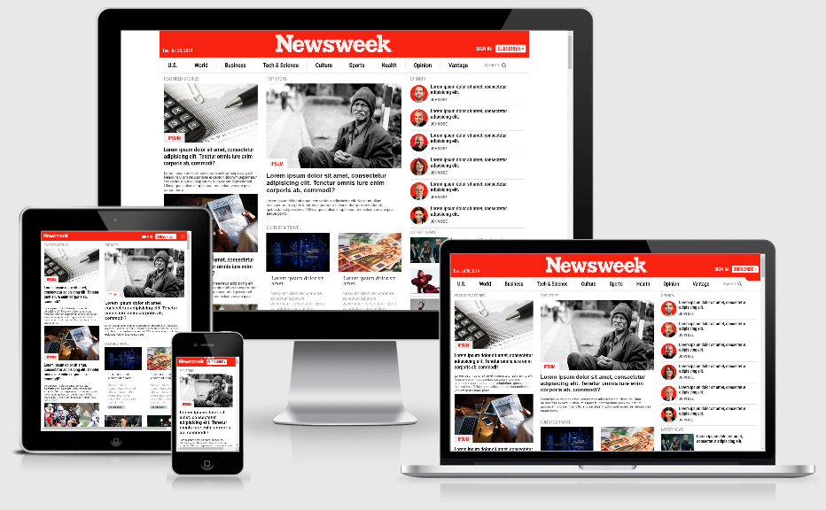

## Project
Responsive design using CSS

## Description
This project is a clone of the site [newsweek.com](https://newsweek.com/) which tries to replicate the responsive behaviour of the original site using bootstrap.

* [Live preview](https://davitomix.github.io/newsweek-clone-bootstrap/)

## Source
https://www.theodinproject.com/courses/html5-and-css3/lessons/using-bootstrap

#Github Repo
https://github.com/davitomix/newsweek-clone-bootstrap

## Author
[David Martinez](https://github.com/davitomix)

